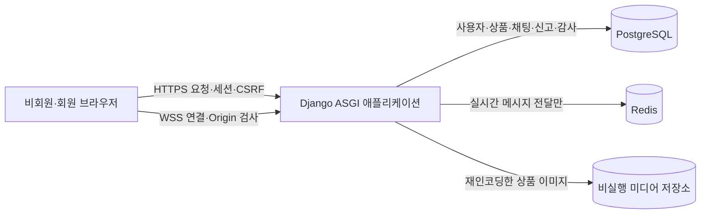
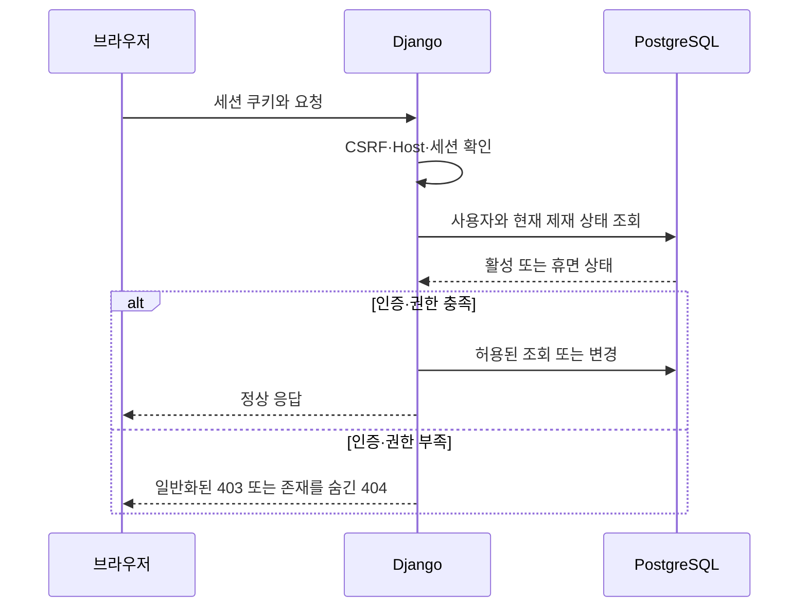
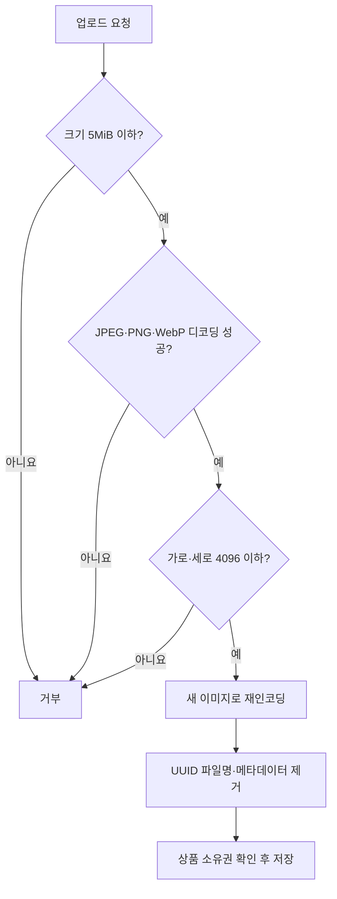
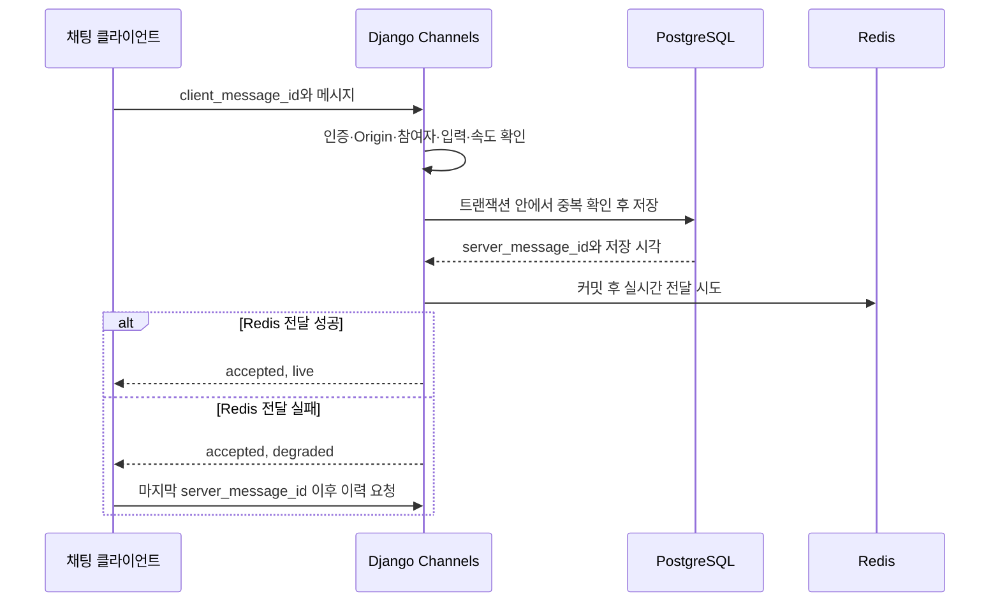
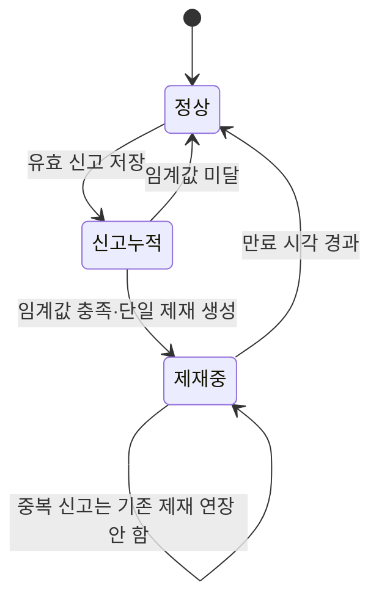

# 02. 시스템 설계

## 2.1 설계 기준과 현재 상태

플랫폼은 브라우저와 Django가 같은 출처를 사용하는 단일 ASGI 애플리케이션으로 설계했습니다. PostgreSQL은 사용자·상품·채팅·신고·거래 기록의 영속 저장소이고, Redis는 실시간 채팅 전달을 위한 비영속 fan-out에만 사용합니다.

2026-07-16 기준 아래 1차 ASGI 구조, 모델·마이그레이션, URL·화면과 종단 서비스를 구현했습니다. PostgreSQL·Redis를 연결한 자동 테스트, 운영 설정 점검과 `.env` 없는 Docker Compose 실행을 확인했습니다. 실제 프록시·백업 복원·브라우저 관찰은 종합 검증 근거로 분리합니다.

## 2.2 기술 구성

| 구분 | 기술 | 역할 | 상태 |
|---|---|---|---|
| 언어 | Python 3.12 | 백엔드 실행 환경 | 1차 구현 |
| 웹 프레임워크 | Django 5.2 LTS | 인증, 세션, ORM, 화면, HTTP 요청 처리 | 1차 구현 |
| 비동기 통신 | ASGI, Django Channels | HTTP와 WebSocket 통합 | 1차 구현 |
| 데이터베이스 | PostgreSQL | 영속 데이터와 트랜잭션의 기준 | 적용·검증 |
| 메시지 전달 | Redis | Channels 실시간 fan-out | 1차 구현 |
| 화면 | Django Templates, vanilla JavaScript | 같은 출처의 서버 렌더링 UI | 1차 구현 |
| 로컬 실행 | Docker Compose | 앱·DB·Redis 구성 | 실행 확인 |

## 2.3 전체 구성

### 신뢰 경계

| 경계 | 주요 위험 | 설계 원칙 |
|---|---|---|
| 브라우저 → HTTP | 세션 탈취, CSRF, 입력 조작, 객체 권한 우회 | Secure/HttpOnly/SameSite 쿠키, CSRF, 서버 권한 재검사 |
| 브라우저 → WebSocket | 비인증 연결, Origin 위조, 타인 방 입장, 과도한 메시지 | 인증·Origin·참여자·크기·속도·계정 상태 검사 |
| Django → PostgreSQL | 경합, 부분 저장, 권위 상태 불일치 | 트랜잭션, 고유 제약, DB 시각, 행 잠금 |
| Django → Redis | Redis 장애를 저장 실패로 오인 | PostgreSQL 저장 성공과 실시간 전달 결과 분리 |
| 업로드 → 미디어 | 위장 파일, 스크립트, 메타데이터, 경로 조작 | 완전 디코딩·재인코딩, UUID 파일명, 크기·해상도 제한 |

## 2.4 주요 요청 흐름

### 인증과 권한 확인

요청에 포함된 사용자 ID나 소유자 ID를 신뢰하지 않고, 로그인 세션에서 행위자를 결정해야 합니다. 프로필·상품·채팅방·관리 기능은 각 진입점에서 다시 권한을 확인합니다.

### 상품 이미지 업로드

현재 개발 코드에는 허용 확장자와 크기·해상도 계약이 정의되어 있지만, Pillow 기반 완전 디코딩·재인코딩 구현과 우회 테스트는 아직 필요합니다.

### 채팅 저장과 전달

PostgreSQL 커밋이 메시지 수락의 기준입니다. Redis 장애가 저장 결과를 되돌리거나 같은 메시지를 중복 저장하게 해서는 안 됩니다.

### 신고와 가역 제재

신고 저장, 임계값 판정, 제재 생성, 소비된 신고 연결, 감사 기록을 하나의 트랜잭션으로 처리해야 합니다. 저장된 플래그만 믿지 않고 DB 현재 시각과 유효 제재를 조회해 상태를 계산합니다.

## 2.5 데이터 모델

| 모델 | 주요 필드·관계 | 현재 확인된 상태 |
|---|---|---|
| `User` | Django `AbstractUser`, 고유 `username`, `bio`, `auth_epoch` | 모델·마이그레이션 적용·검증 |
| `Product` | `owner`, `title`, `description`, `price`, `sale_state`, `image`, `version`, 생성·수정 시각 | 모델·마이그레이션 적용·검증 |
| `Room` | 전체·1대1 구분, 정렬된 두 사용자, 생성 시각 | 모델·마이그레이션 적용·검증 |
| `RoomParticipant` | 방과 사용자 관계, 참여 시각, 방-사용자 고유 제약 | 서비스에서 1대1 정확히 두 명 적용·검증 |
| `ChatMessage` | 방, 발신자, connection/client UUID, 본문, payload hash, 전달 상태, 저장 시각 | 모델·마이그레이션 적용·검증 |
| `AbuseReport` | 신고자, 사용자·상품 대상, 맥락, 사유, 소비된 제재, 생성 시각 | 모델·마이그레이션 적용·검증 |
| `ModerationAction` | 사용자 휴면·상품 비노출, 시작·만료 시각, 대상 | 정확히 7일 제약 적용·검증 |
| `AuditEvent` | 행위 유형, 행위자, 제재, 세부 내용, 생성 시각 | 제재별 한 건 제약 적용·검증 |
| 이체·관리 모델 | 모의 계정·이체·원장·관리 감사 | 구현 예정 |

실제 마이그레이션 적용과 모델 제약 자동 테스트를 확인했습니다. 기능 구현 과정에서 필드나 관계가 바뀌면 마이그레이션과 이 표를 함께 갱신합니다.

## 2.6 보안 고려사항과 확인 방법

| 기능 | 보안 고려사항 | 적용 방식 | 확인 방법 | 상태 |
|---|---|---|---|---|
| 로그인 | 무차별 대입, 계정 존재 노출 | DB 권위 실패 제한, 상태 정리, 일반화된 응답 | 경계·병렬·알 수 없는 계정 테스트 | PASS |
| 프로필·상품 | IDOR, 대량 할당 | 세션 행위자와 객체 소유권 확인, 변경 필드 allowlist | 타인 객체 변경 음성 테스트 | PASS |
| 이미지 | 위장 MIME, 스크립트, 이미지 폭탄 | 제한 후 완전 디코딩·재인코딩, UUID 이름 | 변조·과대·손상·메타데이터 테스트 | PASS |
| 채팅 | XSS, Origin 위조, 타인 방 접근, 중복 저장 | text 출력, 정확 Origin·참여자·UUID·현재 상태 검사 | Origin·재전송·장애·휴면 수신 테스트 | PASS |
| 신고·제재 | 자기·중복 신고, Sybil, 경합 | 유효 신고 조건, 대상 잠금, 고유 제약, 가역 제재 | 임계값·동시 신고·만료 테스트 | PASS |
| 모의 이체 | 잔액 불일치, 중복 이체, 경합 | 행 잠금, 이중 분개, 멱등성 키, 실패 롤백 | 동시성·재시도·합계 보존 테스트 | 구현 예정 |
| 오류·로그 | 비밀값·내부 구조 노출 | 일반화된 오류, 민감값 미기록 | 자동 오류·로그 점검 PASS, 운영 500 수동 확인 필요 | 확인 필요 |

## 2.7 남은 설계 확인 사항

- 운영 환경의 프록시·TLS·오류 화면 확인
- 백업·복원과 서비스 재시작 확인
- 관리자 기능의 작업별 권한과 재인증 범위
- 모의 이체의 계정 생성, 잔액 상한, 이중 분개·복구 정책
