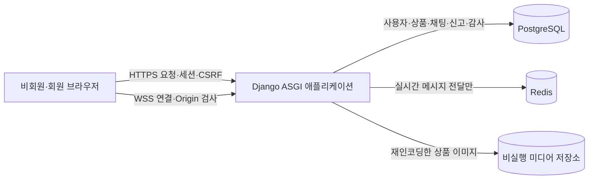
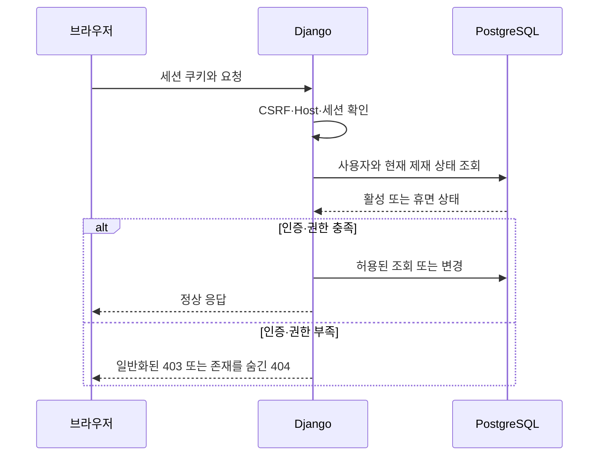
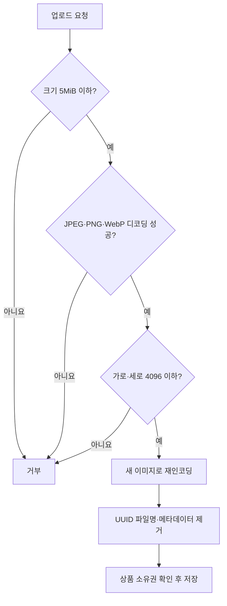
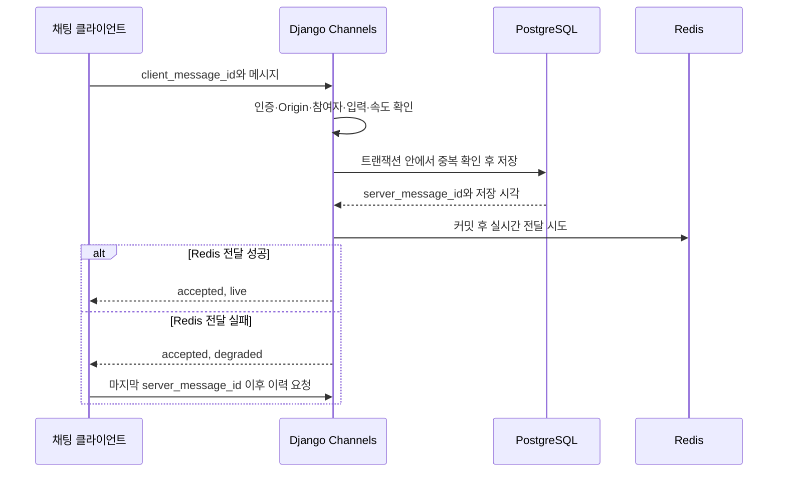
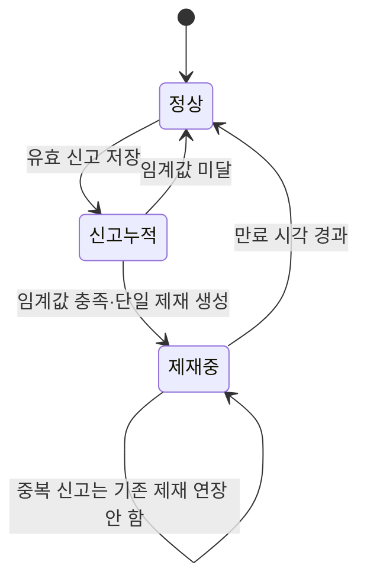
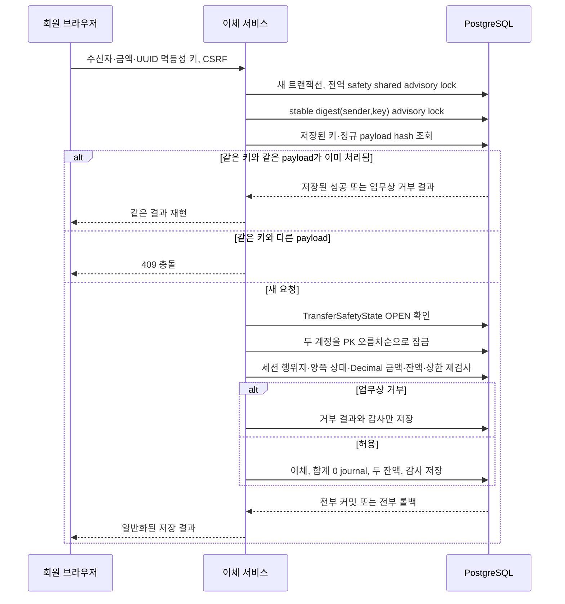

# 02. 시스템 설계

## 2.1 설계 기준과 현재 상태

플랫폼은 브라우저와 Django가 같은 출처를 쓰는 단일 ASGI 애플리케이션으로 설계했습니다. PostgreSQL은 사용자·상품·채팅·신고·거래 기록을 영속적으로 저장하고, Redis는 실시간 채팅 전달을 위한 비영속 fan-out에만 사용합니다.

2026-07-22 기준으로 단일 Django ASGI 구조에 사용자·상품·검색·채팅·알림·거래·모의 이체·관리·후기·회원 탈퇴 기능과 PostgreSQL 마이그레이션을 구현했습니다. PostgreSQL이 영속 권위이며 Redis는 재구축 가능한 전달·presence projection입니다. 자동 테스트, 마이그레이션, 백업→빈 DB 복원, 브라우저·axe 검증 결과는 종합 검증 근거로 따로 구분합니다.

## 2.2 기술 구성

| 구분 | 기술 | 역할 | 상태 |
|---|---|---|---|
| 언어 | Python 3.12 | 백엔드 실행 환경 | 1차 구현 |
| 웹 프레임워크 | Django 5.2 LTS | 인증, 세션, ORM, 화면, HTTP 요청 처리 | 1차 구현 |
| 비동기 통신 | ASGI, Django Channels | HTTP와 WebSocket 통합 | 1차 구현 |
| 데이터베이스 | PostgreSQL | 영속 데이터와 트랜잭션의 기준 | 적용·검증 |
| 메시지 전달 | Redis | Channels 실시간 fan-out | 1차 구현 |
| 화면 | Django Templates, vanilla JavaScript | 같은 출처의 서버 렌더링 UI | 1차 구현 |
| 로컬 실행 | Docker Compose | 앱·DB·Redis 구성 | 실행 확인 |

## 2.3 전체 구성

### 신뢰 경계

| 경계 | 주요 위험 | 설계 원칙 |
|---|---|---|
| 브라우저 → HTTP | 세션 탈취, CSRF, 입력 조작, 객체 권한 우회 | Secure/HttpOnly/SameSite 쿠키, CSRF, 서버 권한 재검사 |
| 브라우저 → WebSocket | 비인증 연결, Origin 위조, 타인 방 입장, 과도한 메시지 | 인증·Origin·참여자·크기·속도·계정 상태 검사 |
| Django → PostgreSQL | 경합, 부분 저장, 권위 상태 불일치 | 트랜잭션, 고유 제약, DB 시각, 행 잠금 |
| Django → Redis | Redis 장애를 저장 실패로 오인 | PostgreSQL 저장 성공과 실시간 전달 결과 분리 |
| 업로드 → 미디어 | 위장 파일, 스크립트, 메타데이터, 경로 조작 | 완전 디코딩·재인코딩, UUID 파일명, 크기·해상도 제한 |

## 2.4 주요 요청 흐름

### 인증과 권한 확인

요청에 담긴 사용자 ID나 소유자 ID를 신뢰하지 않고 로그인 세션으로 행위자를 결정해야 합니다. 프로필·상품·채팅방·관리 기능도 각 진입점에서 권한을 다시 확인합니다.

### 상품 이미지 업로드

현재 개발 코드에는 Pillow 기반의 완전 디코딩·재인코딩과 우회 테스트까지 반영했습니다.

### 채팅 저장과 전달

메시지 수락 여부는 PostgreSQL 커밋으로 판단합니다. Redis 장애로 저장 결과를 되돌리거나 같은 메시지가 중복 저장되어서는 안 됩니다.

### 신고와 가역 제재

신고 저장, 임계값 판정, 제재 생성, 소비된 신고 연결, 감사 기록은 하나의 트랜잭션으로 처리해야 합니다. 저장된 플래그만 믿지 말고 DB 현재 시각과 유효 제재를 조회해 상태를 계산합니다.

## 2.5 2차 기능 구현 설계

이 절의 모의 이체·상품 검색·관리자 기능은 아래 설계를 그대로 사용하는 제품 코드와 마이그레이션으로 구현했습니다.

### 모의 잔액 이체의 데이터·제어 흐름

- 사용자 온라인 조회의 권위값은 `MockAccount.balance`입니다. `LedgerJournal`은 하나의 원자적 사건을 묶고, 모든 journal은 정확히 두 entry와 합계 0을 가져야 합니다.
- 사용자 `MockAccount`는 대응하는 사용자 `LedgerAccount`와 1:1 관계입니다. 사용자에게 노출하지 않는 `SYSTEM_ISSUANCE` 유형의 `SEED_RESERVE` 계정 하나를 두며, 이 계정에는 사용자 잔액 상한·종료·송수신 대상 규칙을 적용하지 않습니다.
- 신규 계정 생성과 기존 회원 backfill은 계정, 사용자 ledger 계정, 초기 잔액 100,000.00, 사용자 `+100,000.00`·reserve `-100,000.00`의 `SEED_ISSUE` journal을 하나의 트랜잭션에서 만듭니다. `journal_kind=SEED_ISSUE AND target_mock_account IS NOT NULL` 조건의 `(target_mock_account)` 부분 고유 제약으로 발행은 한 번으로 제한하되 이후 `TRANSFER`·`COMPENSATION` journal은 막지 않습니다.
- PostgreSQL deferred constraint trigger는 journal/entry INSERT를 커밋 시점에 검사하며, UPDATE·DELETE trigger는 `LedgerJournal`과 `LedgerEntry`를 모두 불변으로 만듭니다. 이체·두 잔액·감사도 같은 트랜잭션에서 저장합니다.
- 잔액은 현금 가치가 없는 `Decimal(12,2)` 모의 단위입니다. 1회 이체는 0.01~99,999,999.99, 결과 사용자 잔액은 0~1,000,000,000.00으로 제한하며 충전·출금·환전은 제공하지 않습니다.
- 트랜잭션은 `(sender, idempotency_key)`의 안정적인 64-bit digest로 `pg_advisory_xact_lock`을 먼저 얻습니다. digest는 프로세스별 hash가 아닌 고정 암호학적 digest 변환을 쓰므로 모든 인스턴스가 같은 키를 잠급니다. 충돌은 안전을 위해 서로 다른 요청을 직렬화할 뿐입니다.
- safety shared lock과 멱등성 advisory lock을 차례로 얻은 뒤 `(sender, idempotency_key)` 고유 행을 조회합니다. canonical payload는 버전 1, 변형하지 않은 수신자 아이디 원문, 금액의 고정 둘째 자리 문자열을 키 순서가 고정된 UTF-8 JSON으로 직렬화합니다. `1`·`1.0`·`1.00`은 같으며 수신자 원문 또는 금액이 다르면 409입니다. 최초 성공과 업무상 거부의 HTTP 상태·body를 저장하고, 같은 payload는 현재 잔액·계정 상태나 `TransferSafetyState=BLOCKED` 여부와 무관하게 저장 결과를 그대로 재현합니다. `OPEN` 검사는 저장 결과가 없는 새 키에만 적용하며, 새 요청에서만 수신자를 정확 일치로 조회해 계정을 잠급니다.
- 잠금 순서는 safety shared advisory lock → 멱등성 advisory lock → 계정 PK 오름차순입니다. 대사·재개는 같은 safety 키의 exclusive advisory lock을 사용해 기존 이체·종료가 끝난 뒤 검사하고 새 요청을 막습니다. `40001`·`40P01`만 최초 시도 뒤 재시도할 때마다 새 트랜잭션을 열어 최대 3회 처리합니다.
- 인증된 소유자의 계정 종료 POST도 대상 `MockAccount` 행을 잠그고 열린 상태와 잔액 0.00을 다시 확인한 후 닫습니다. 종료가 먼저면 뒤 이체는 거부되고, 이체가 먼저면 종료는 갱신된 잔액을 기준으로 결정됩니다. 별도의 처리 중 카운터는 필요하지 않습니다.
- 휴면 사용자와 자기 자신은 송신자나 수신자가 될 수 없습니다. 계정 잠금 안에서 DB 현재 시각의 공통 사용자 상태 정책으로 상태를 다시 확인합니다.
- `TransferSafetyState`는 safety lock 안에서 검사합니다. 대사는 exclusive lock으로 전체 불일치를 확인해 incident와 함께 `BLOCKED`로 전환하고, maintainer 재개도 exclusive lock 안에서 전체 불일치 0건과 정확한 incident를 검증한 뒤 `OPEN`으로 바꿉니다. 따라서 BLOCKED 전환 뒤에는 늦은 이체 커밋이 없습니다.

### 상품 검색의 데이터·제어 흐름

검색은 공개 상품 목록을 읽기 전용으로 확장한 기능입니다. 2차 migration은 기존 상품 제목·설명을 NFC로 backfill하고 DB CHECK로 NFC 저장을 강제하며, 생성·수정 서비스도 저장 전에 NFC로 정규화합니다. `q`도 Unicode trim→NFC 뒤 code point 0~100자로 제한하고 C0/C1을 거부합니다. 이후 공개 범위 안에서 제목·설명 `icontains`를 수행합니다.

허용하는 정렬은 기본 최신순, 가격낮은순, 가격높은순이며 모두 상품 `id` 내림차순을 보조 키로 붙입니다. 페이지는 `1..500`, 20건으로 고정하며 501 이상은 상품 쿼리 전에 400입니다. 검색 서비스 호출만 측정할 때는 공개 결과 count 1회와 정렬된 slice 조회 1회만 허용하고 인증·세션 middleware 쿼리는 이 예산에서 제외합니다. 비노출 상품은 결과·전체 건수·페이지 경계에 포함하지 않으며 검색어 원문·내부 SQL도 기록하지 않습니다.

### 관리자 권한과 행위 흐름

관리 화면에 들어가려면 `is_staff`가 필요합니다. 일반 관리 작업은 아래 custom codename과 활성 `AdminScopeGrant`를 모두 검사합니다. `manage_admin_scope`만 대상 콘텐츠 grant가 필요 없는 명시적 meta-scope 예외이며 별도 최고관리자 조건을 적용합니다.

- `moderation.view_report`: 대상 사용자·상품에 연결된 신고 열람
- `moderation.apply_sanction`: 대상 사용자 휴면 또는 상품 비노출 적용
- `moderation.release_sanction`: 대상 제재 조기 해제
- `moderation.view_admin_audit`: 대상에 연결된 관리 감사 열람
- `moderation.manage_admin_scope`: 최고관리자의 범위 부여·취소 전용 권한

`AdminScopeGrant`는 staff, codename, nullable `target_user` FK, nullable `target_product` FK, 부여·취소 메타데이터를 저장합니다. DB CHECK는 정확히 한 대상 FK만 허용하고 두 부분 고유 제약은 대상별 활성 중복을 막습니다. 신고·제재·감사 범위는 연결 FK로 계산합니다. 비인증 HTML은 302, staff/codename 부족은 403, 미존재·범위 밖은 같은 404이며 grant를 취소하면 `auth_epoch`로 기존 세션을 무효화합니다.

상태 변경 POST는 정확한 codename·grant, CSRF, 서버 UTC 기준 재인증 나이 300초 이하, 대상 `version`을 검사합니다. 사유는 Unicode 공백을 trim하고 NFC 처리한 뒤 C0/C1 제어문자를 거부하며 code point 기준 10~500자여야 합니다. 범위 변경은 `manage_admin_scope` 최고관리자만 할 수 있고 자기 grant 변경은 금지하며, 변경 자체도 감사합니다.

| 작업 | 필요한 codename | 필요한 대상 grant | 결과 |
|---|---|---|---|
| 신고 사유·처리 상태 조회 | `view_report` | 신고가 가리키는 USER/PRODUCT | 허용 필드만 읽기 |
| 사용자 휴면·상품 비노출 적용 | `apply_sanction` | 변경할 USER/PRODUCT | 정확히 7일 제재 |
| 사용자·상품 제재 조기 해제 | `release_sanction` | 원 제재의 USER/PRODUCT | 원본 보존·해제 기록 추가 |
| 관리 감사 메타데이터 조회 | `view_admin_audit` | 감사 대상 USER/PRODUCT | 읽기 전용 |
| 범위 부여·취소 | `manage_admin_scope` | 없음(meta-scope 예외) | `is_superuser`+직접 permission·자기 변경 금지 |

비밀번호 hash·세션·비밀값·채팅 본문·모의 잔액·원장은 관리 응답에 포함하지 않습니다. 영구 삭제·대필·잔액/원장/감사 수정도 제공하지 않습니다. 감사 테이블에서 애플리케이션 DB 역할에는 SELECT·INSERT만 허용되며, UPDATE·DELETE는 권한과 DB trigger로 거부합니다.

제재 적용 기간은 DB 현재 시각부터 정확히 7일입니다. 병렬 적용은 활성 제재와 적용 성공 감사만 각각 1건 만들며, 정확한 만료 시각부터 활성 제재는 0건이고 자연 만료 자체로는 해제 기록이나 성공 감사를 만들지 않습니다. 만료 시각 이후 해제 POST는 `409`와 충돌 감사 1건을 남기지만 `SanctionRelease`는 만들지 않습니다. 만료 전 조기 해제는 별도 `SanctionRelease`와 성공 감사를 각각 1건 만들며 병렬·반복 해제는 저장된 결과만 반환합니다.

감사 INSERT에 실패하면 같은 트랜잭션의 업무 변경을 롤백하고 DB 감사 0건, 민감값 없는 상관 ID 오류와 HTTP 503을 남깁니다. 감사 UPDATE·DELETE는 DB 권한과 trigger로 거부합니다.

### 2차 HTTP 계약

2차 기능은 기존 세션 인증과 Django CSRF를 재사용합니다. JSON 오류 코드는 이체·계정 종료 API에만 적용하고 HTML 관리·검색 화면에는 상태 코드와 일반 오류 페이지를 사용합니다.

#### 이체 JSON API

`POST /transfers/`는 `application/json`만 받고 `recipient`, `amount`, `idempotency_key` 세 필드만 허용하며 누락·추가 필드는 `400 INVALID_REQUEST`입니다. `recipient`는 trim하지 않은 1..150 code point 문자열, `amount`는 JSON 문자열이며 `^(0|[1-9][0-9]{0,7})(\.[0-9]{1,2})?$`, `idempotency_key`는 소문자 canonical UUID 문자열입니다. 성공 body는 정확히 `{"transfer_id":"UUID","status":"completed","recipient":"원문","amount":"0.00","sender_balance":"0.00"}` 다섯 필드입니다. 같은 키·payload 재현은 최초 status와 body를 그대로 반환하므로 신규와 성공 재현 모두 `201`이고, 저장된 업무 거부 재현은 최초 오류 status와 body를 그대로 반환합니다.

| 결과 | HTTP | JSON `error_code` |
|---|---:|---|
| 비인증 / CSRF 실패 | 401 / 403 | `AUTH_REQUIRED` / `CSRF_FAILED` |
| 형식·범위 오류 | 400 | `INVALID_REQUEST` |
| 같은 키·다른 payload | 409 | `IDEMPOTENCY_CONFLICT` |
| 자기·미존재·비활성·종료·부족·상한 | 422 | `TRANSFER_NOT_ALLOWED` |
| 새 키의 BLOCKED·재시도 소진 | 503 | `TRANSFER_UNAVAILABLE` |

`POST /transfers/account/close/`는 세션 사용자의 계정만 대상으로 하며 body와 추가 필드를 허용하지 않습니다. 최초·반복 종료는 모두 body 없는 `204`이며, 비인증은 `401 AUTH_REQUIRED`, CSRF 실패는 `403 CSRF_FAILED`, 잘못된 body는 `400 INVALID_REQUEST`, 잔액이 있으면 `409 ACCOUNT_NOT_EMPTY`, 전역 차단은 `503 TRANSFER_UNAVAILABLE`입니다. 요청에 대상 ID를 받지 않으므로 타인 계정 종료라는 표현 자체가 성립하지 않습니다.

#### 검색·관리 HTML

| 요청 | 정확한 query/form 필드 | 성공 | 거부·오류 |
|---|---|---|---|
| `GET /products/` | `q`, `status=available\|sold`, `min_price`, `max_price`, `sort=newest\|price_asc\|price_desc`, `page=1..500`; 추가 query 금지 | HTML 200 | 입력·추가 필드 400 |
| `GET /management/reports/` | `target_type=user\|product`, 양의 10진 `target_id`, `page=1..500`; 추가 query 금지 | HTML 200 | 비인증 302, 권한 403, 미존재·범위 밖 404, 입력·추가 필드 400 |
| `GET /management/audit/` | reports 필드 + `action=apply\|release\|grant\|revoke\|deny\|conflict`; 추가 query 금지 | HTML 200 | reports와 동일 |
| `POST /management/sanctions/apply/` | `target_type=user\|product`, 양의 10진 `target_id`, `reason`, `version`, CSRF; 추가 form 필드 금지 | HTML 200 | 권한 부족 403, 미존재·범위 밖 404, 입력·재인증·추가 필드 400, stale 409, 감사 장애 503 |
| `POST /management/sanctions/<id>/release/` | URL의 양의 10진 sanction `id`, `reason`, `version`, CSRF; 추가 form 필드 금지 | HTML 200 | apply와 동일; 자연 만료 뒤 요청은 409·충돌 감사 1건·`SanctionRelease` 0건 |
| `POST /management/scopes/grant/` | 양의 10진 `staff_id`, `codename=view_report\|apply_sanction\|release_sanction\|view_admin_audit`, `target_type=user\|product`, 양의 10진 `target_id`, `reason`, `version`(대상 staff `auth_epoch`), CSRF; 추가 form 필드 금지 | HTML 200 | meta-scope·자기 변경 403, 입력·재인증·추가 필드 400, 미존재 404, stale/중복 409, 감사 장애 503 |
| `POST /management/scopes/<id>/revoke/` | URL의 양의 10진 grant `id`, `reason`, grant `version`, CSRF; 추가 form 필드 금지 | HTML 200 | 권한·자기 변경 403, 입력·재인증·추가 필드 400, 미존재 404, stale 409, 감사 장애 503 |

`최고관리자`는 활성 사용자이면서 `is_superuser=True`이고 `moderation.manage_admin_scope`가 `user_permissions`에 직접 부여된 사용자입니다. 이 meta-scope에는 대상 콘텐츠 grant가 필요 없지만 자기 grant는 바꿀 수 없습니다. 최초·복구 direct permission은 `scope_bootstrap` DB 역할의 `bootstrap_scope_manager --username USERNAME --reason REASON`만 부여합니다. 명령은 전용 bootstrap advisory lock을 얻은 단일 트랜잭션에서 유효 최고관리자 0명을 다시 확인하고, 활성 superuser 대상의 permission과 추가 전용 감사 1건을 함께 커밋합니다. `REASON`은 NFC 정규화한 10..500 code point이며, 감사 실패 시 permission도 롤백합니다. 병렬 실행의 패자는 잠금 뒤 0명 조건을 다시 검사할 때 결정적으로 거부됩니다.

### 2차 신뢰 경계와 위협

| 경계 | 자산·위협 | 설계 통제 | 구현 뒤 검증 |
|---|---|---|---|
| 브라우저 → 이체 서비스 | 잔액, 재전송, CSRF, IDOR, 입력 변조 | 세션 행위자, canonical payload, advisory lock, 공통 상태 정책, 잠금 안 재검사 | 타인 송신자, 같은 키 동등/변조 payload, 자기/휴면/잔액 부족, 시스템 실패 뒤 재시도 |
| 이체 서비스 → PostgreSQL | 부분 커밋, lost update, 교착, 원장 불일치 | 고정 잠금 순서, 단일 트랜잭션, 이중 분개, 허용 SQLSTATE만 3회 재시도, 전역 safety state | 병렬 이체·종료, 강제 종료, 합계 보존, 차단·복구 |
| 브라우저 → 검색 | 주입, 비노출 정보 유출, 고비용 질의, 불안정 페이지 | NFC·code point 상한, allowlist ORM, 공개 범위 선적용, `1..500` 페이지, 결정적 정렬 | 정규화 전후 길이, 비노출, 500/501, 서비스 블록 2-query 예산 |
| 관리자 브라우저 → 관리 서비스 | 권한 상승, CSRF, 오래된 화면, 과도한 권한 | staff+custom codename+활성 grant, 302/403/404 정책, 300초 재인증, 정규화 사유, version | 역할·범위·grant 취소, 299/300/301초, 사유 경계, CSRF·stale version |
| 관리 서비스 → 감사 저장소 | 행위 부인, 감사 변조, 민감 본문 유출 | 업무와 감사 단일 트랜잭션, SELECT·INSERT 전용 DB 권한·trigger, 민감값 제외 | 성공/거부/충돌 각 감사 1건, INSERT 실패 503·전부 롤백, UPDATE/DELETE 거부 |

2차 로그에는 correlation ID와 결과 분류만 남기고 비밀번호·세션·원문 IP·검색어 원문·채팅 본문은 기록하지 않습니다. Sybil, 분산 검색 남용과 권한 설정 오류를 완전히 제거할 수는 없으므로 속도·비용 지표, 반복 거부, 원장 불일치, 감사 변경 시도를 경보 대상으로 둡니다.

## 2.6 데이터 모델

| 모델 | 주요 필드·관계 | 현재 확인된 상태 |
|---|---|---|
| `User` | Django `AbstractUser`, 고유 `username`, `bio`, `auth_epoch` | 모델·마이그레이션 적용·검증 |
| `Product` | `owner`, `title`, `description`, `price`, `sale_state`, `image`, `version`, 생성·수정 시각 | 모델·마이그레이션 적용·검증 |
| `Room` | 전체·1대1 구분, 정렬된 두 사용자, 생성 시각 | 모델·마이그레이션 적용·검증 |
| `RoomParticipant` | 방과 사용자 관계, 참여 시각, 방-사용자 고유 제약 | 서비스에서 1대1 정확히 두 명 적용·검증 |
| `ChatMessage` | 방, 발신자, connection/client UUID, 본문, payload hash, 전달 상태, 저장 시각 | 모델·마이그레이션 적용·검증 |
| `AbuseReport` | 신고자, 사용자·상품 대상, 맥락, 사유, 소비된 제재, 생성 시각 | 모델·마이그레이션 적용·검증 |
| `ModerationAction` | 사용자 휴면·상품 비노출, 시작·만료 시각, 대상 | 정확히 7일 제약 적용·검증 |
| `AuditEvent` | 행위 유형, 행위자, 제재, 세부 내용, 생성 시각 | 제재별 한 건 제약 적용·검증 |
| 2차 이체·관리 모델 | `MockAccount`, `LedgerAccount`, `LedgerJournal`, 불변 `LedgerEntry`, `Transfer`, `TransferSafetyState`, `AdminScopeGrant`, `SanctionRelease`, append-only 관리 감사 | 구현·마이그레이션 적용 |

2차 모델의 전진 마이그레이션과 모델 drift 검사를 실제 PostgreSQL에서 실행했으며 세부 결과는 검증 기록에 남깁니다.

## 2.7 보안 고려사항과 확인 방법

| 기능 | 보안 고려사항 | 적용 방식 | 확인 방법 | 상태 |
|---|---|---|---|---|
| 로그인 | 무차별 대입, 계정 존재 노출 | DB 권위 실패 제한, 상태 정리, 일반화된 응답 | 경계·병렬·알 수 없는 계정 테스트 | PASS |
| 프로필·상품 | IDOR, 대량 할당 | 세션 행위자와 객체 소유권 확인, 변경 필드 allowlist | 타인 객체 변경 음성 테스트 | PASS |
| 이미지 | 위장 MIME, 스크립트, 이미지 폭탄 | 제한 후 완전 디코딩·재인코딩, UUID 이름 | 변조·과대·손상·메타데이터 테스트 | PASS |
| 채팅 | XSS, Origin 위조, 타인 방 접근, 중복 저장 | text 출력, 정확 Origin·참여자·UUID·현재 상태 검사 | Origin·재전송·장애·휴면 수신 테스트 | PASS |
| 신고·제재 | 자기·중복 신고, Sybil, 경합 | 유효 신고 조건, 대상 잠금, 고유 제약, 가역 제재 | 임계값·동시 신고·만료 테스트 | PASS |
| 모의 이체 | 잔액 불일치, 중복 이체, 경합 | 행 잠금, 이중 분개, 멱등성 키, 실패 롤백 | 동시성·재시도·합계 보존 테스트 | 구현·자동 검증 수행 |
| 상품 검색 | 주입, 비노출 정보 유출, 자원 고갈 | 공개 범위 선적용, allowlist, 입력 상한, `1..500` 페이지, 고정 정렬 | 주입·필터·정렬·500/501 페이지 경계·비노출 테스트 | 구현·자동 검증 수행 |
| 관리자 | 권한 상승, CSRF, stale write, 감사 변조 | 작업 권한·객체 범위·재인증·version·append-only 감사 | 역할 교차·재인증·CSRF·경합·감사 불변 테스트 | 구현·자동 검증 수행 |
| 오류·로그 | 비밀값·내부 구조 노출 | 일반화된 오류, 민감값 미기록 | 자동 오류·로그 점검 PASS, 운영 500 수동 확인 필요 | 확인 필요 |

## 2.8 구현 전 확인 경계

- 2차 정책 값은 [요구사항 분석](01-requirements.md)의 한국어 식별자와 테스트 예시를 단일 기준으로 삼습니다.
- 이 절의 모델·서비스·권한표는 설계이며 아직 마이그레이션, URL, 화면 또는 실행 가능한 제품 기능이 아닙니다.
- 구현 단계에서 이체 invariant·검색 공개 범위·관리자 작업별 권한을 바꾸면 요구사항, 의사결정 기록, 검증 계약도 함께 갱신해야 합니다.
