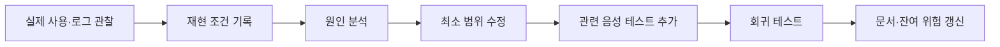

# 05. 유지보수

## 5.1 현재 상태

이 장은 개발·검증 중 배포 전에 수정한 결함과 정식 릴리스 뒤 유지관리자가 관찰해 수정한 결함을 구분해 기록합니다. 5.2는 배포 전 점검 사례이고, 5.3은 실제 사용자 신고가 아니라 정식 릴리스에 대한 유지관리자 검증에서 발견한 사례입니다.

## 5.2 배포 전 발견·수정 기록

| 사례 | 발견 당시 상태 | 수정 내용 | 확인 결과 |
|---|---|---|---|
| 화면 이동 경로 | 주요 기능으로 이동하는 메뉴가 충분히 눈에 띄지 않아 사용자가 기능 진입점을 찾기 어려웠습니다. | 주요 화면으로 이동하는 내비게이션을 보완했습니다. | 브라우저 흐름에서 회원가입, 상품, 채팅, 신고 화면으로 이동할 수 있음을 확인했습니다. |
| 개발·검증 의존성 | pytest 의존성에서 알려진 취약점이 확인되었습니다. | pytest를 9.0.3으로 갱신했습니다. | 모든 의존성 그룹 점검에서 알려진 취약점이 없음을 확인했습니다. |
| 개발 환경의 채팅 자산 | DEBUG 환경에서 채팅 JavaScript 정적 자산 제공을 확인할 필요가 있었습니다. | 정적 자산 제공 경로를 바로잡았습니다. | `/static/chat/chat.js`가 HTTP 200 및 `text/javascript`로 응답함을 확인했습니다. |
| 회원가입 안내 | 가입 화면의 안내가 한국어 사용자에게 비밀번호 조건을 충분히 전달하지 못했습니다. | 한국어 안내 문구와 비밀번호 조건을 화면에 표시했습니다. | 회원가입 화면에서 안내 문구를 확인했습니다. |

이 표의 ‘발견 당시 상태’는 수정 전의 기록입니다. 현재 상태를 뜻하지 않으며, 각 항목은 위 확인 결과와 같이 수정 후 다시 점검했습니다.
## 5.3 정식 릴리스 관찰 후 수정 사례

### MNT-01. 공개 테스트 절차의 실행 인프라 누락

| 항목 | 내용 |
|---|---|
| 사례 ID | `MNT-01` |
| 발견 환경 | 정식 릴리스 `v0.1.0`, `.env` 없는 기본 Docker Compose |
| 문제 현상 | README의 전체 테스트 명령은 `127.0.0.1:5432`의 PostgreSQL과 `127.0.0.1:6379`의 Redis를 전제했지만 기본 Compose는 두 포트를 호스트에 공개하지 않아 테스트 준비 단계에서 연결이 거부됐습니다. |
| 원인 | 애플리케이션 실행 절차와 호스트에서 실행하는 전체 테스트 절차가 서로 다른 네트워크 경계를 사용하면서, 테스트 전용 의존성을 준비하는 명령이 문서와 구성에 없었습니다. |
| 추적 | 공개 [GitHub issue #20](https://github.com/RatelXD/secure-coding/issues/20)에 정식 릴리스 SHA, 재현 절차, 기대·실제 결과와 수정 조건을 기록했습니다. |
| 수정 내용 | `compose.test.yaml` 오버레이에 별도 프로젝트·볼륨의 PostgreSQL과 Redis를 추가하고 각각 `127.0.0.1:55432`, `127.0.0.1:56379`에만 공개했습니다. README는 이 오버레이의 준비·테스트·정리 순서를 그대로 실행할 수 있도록 변경했습니다. |
| 음성·회귀 테스트 | `.env`와 `TEST_*` 값이 없는 구성에서 기본 포트, loopback 바인딩, 별도 볼륨 이름을 자동 확인했습니다. 수정된 README 절차를 처음부터 실행해 전체 테스트가 통과하고 테스트 프로젝트를 `down -v`로 정리할 수 있음을 확인했습니다. |
| 결과 | 168 tests, 216 subtests PASS |
| 잔여 위험 | 사용자가 기본 포트를 이미 사용 중이면 `TEST_DB_PORT`와 `TEST_REDIS_PORT`를 다른 loopback 포트로 지정해야 합니다. 테스트 비밀번호는 로컬 전용이며 공유·운영 환경에 재사용하지 않습니다. |

### MNT-02. 상품 이미지 저장 경로 권한과 지속성

| 항목 | 내용 |
|---|---|
| 발견 환경 | 정식 릴리스 `v0.1.0`, `.env` 없는 기본 Docker Compose |
| 문제 현상 | 유효한 PNG 상품 등록이 `/app/media` 권한 오류로 HTTP 500을 반환했습니다. |
| 원인 | 런타임 이미지가 앱 사용자 소유의 미디어 디렉터리를 만들지 않았고 Compose에도 영속 미디어 볼륨이 없었습니다. |
| 추적 | 공개 [GitHub issue #21](https://github.com/RatelXD/secure-coding/issues/21)에 두 차례 재현한 결과와 수정 조건을 기록했습니다. |
| 수정 내용 | 이미지에 앱 사용자 소유 `/app/media`를 만들고 `media-data` 볼륨을 연결해 업로드를 앱 재시작 뒤에도 보존하도록 변경했습니다. |
| 음성·회귀 테스트 | Compose 해석 결과의 미디어 볼륨과 Dockerfile 권한 준비를 자동 확인하고, 깨끗한 Compose에서 유효 이미지 등록·조회·앱 재시작 후 지속성을 확인했습니다. |
| 결과 | 수정 후 유효 이미지 등록은 상세 화면으로 이동하고 미디어 GET은 HTTP 200이며 앱 재시작 뒤에도 유지됩니다. |
| 잔여 위험 | 운영 배포에서는 미디어 백업·용량 제한과 신뢰할 수 있는 외부 저장소 정책이 추가로 필요합니다. |

### MNT-03. 데이터베이스 중단 시 준비 상태 지연

| 항목 | 내용 |
|---|---|
| 발견 환경 | 정식 릴리스 `v0.1.0`의 Docker Compose |
| 문제 현상 | PostgreSQL 중단 뒤 `/readyz/`가 정의된 JSON 503 대신 3초 클라이언트 제한 시간을 초과했습니다. |
| 원인 | 데이터베이스 연결과 TCP 실패 시간이 Compose healthcheck 제한보다 짧게 고정되지 않았습니다. |
| 추적 | 공개 [GitHub issue #22](https://github.com/RatelXD/secure-coding/issues/22)에 중단·복구 관찰 결과를 기록했습니다. |
| 수정 내용 | 호스트명 해석을 0.25초로 제한하고 확인된 모든 주소를 순서대로 시도하는 단일 비동기 PostgreSQL 쿼리를 1.5초 전체 제한 안에서 실행하도록 변경했습니다. |
| 음성·회귀 테스트 | 해석 제한·중복 주소 제거·첫 주소 실패 후 대체 주소 성공·전체 쿼리 제한을 자동 확인하고, 실제 DB 중단 시 0.271초 JSON 503과 DB 재시작 후 HTTP 200을 확인했습니다. |
| 결과 | 준비 상태가 DB 장애를 제한 시간 안에 알리고 복구 후 정상 상태로 돌아옵니다. |
| 잔여 위험 | 네트워크와 커널의 실패 방식에 따라 실제 지연이 달라질 수 있으므로 운영 환경의 오케스트레이터 제한과 함께 다시 확인해야 합니다. |

### MNT-04. 릴리스 불변성 표현의 의미 구분

| 항목 | 내용 |
|---|---|
| 발견 환경 | GitHub의 `v0.1.0-rc.2`, `v0.1.0` 릴리스 API |
| 문제 현상 | GitHub Release 객체는 `immutable=false`인데 설명의 “불변 후보”가 객체 자체의 기술적 불변성을 지원하는 것처럼 읽힐 수 있었습니다. |
| 원인 | 태그와 SHA를 이동하지 않는 프로젝트 규칙과 GitHub Release 객체의 편집 가능 상태를 구분하지 않았습니다. |
| 추적 | 공개 [GitHub issue #23](https://github.com/RatelXD/secure-coding/issues/23)에 차이를 기록했습니다. |
| 수정 내용 | 후속 후보와 정식 릴리스 설명은 “태그와 SHA를 이동하지 않는 후보”로 표기하고 GitHub API의 immutable 상태를 주장하지 않습니다. |
| 검증 | 기존 태그 대상 SHA가 유지되고 문서와 후속 릴리스 설명이 두 의미를 구분하는지 확인합니다. |
| 잔여 위험 | 기존 릴리스 본문은 편집할 수 있으므로 태그 대상과 커밋 이력을 함께 확인해야 합니다. |

## 5.4 이후 운영 유지보수 절차

1. Docker Compose 환경에서 정상 사용자와 악의적 사용 시나리오를 관찰합니다.
2. 발견한 문제의 입력, 사전조건, 기대 결과, 실제 결과를 비밀값 없이 기록합니다.
3. 코드·설정·데이터 상태를 확인해 원인을 좁힙니다.
4. 문제 원인을 직접 수정하고 관련 없는 범위는 바꾸지 않습니다.
5. 같은 문제가 다시 발생하지 않도록 음성 테스트 또는 회귀 테스트를 추가합니다.
6. 수정 전 재현 결과와 수정 후 결과를 확인합니다.
7. 영향 범위, 남은 한계, 사용자에게 보이는 변화를 보고서에 반영합니다.
이 사례는 “정식 릴리스 관찰 → 공개 issue → 최소 수정 → 음성·회귀 테스트 → 문서 갱신” 순서로 처리했습니다.

## 5.5 이후 관찰할 항목

| 영역 | 관찰 시나리오 | 확인할 문제 |
|---|---|---|
| 인증 | 반복 로그인 실패, 세션 만료, 비밀번호 변경 뒤 기존 세션 | 제한 우회, 계정 존재 노출, 세션 무효화 누락 |
| 상품 | 타인 상품 접근, 비노출 전후, 이미지 변조 | IDOR, 캐시·목록 불일치, 업로드 우회 |
| 채팅 | Redis 중단, ACK 유실, 재연결, 같은 UUID 재전송 | 메시지 유실·중복, 잘못된 성공 응답, 이력 누락 |
| 신고·제재 | 임계값 경계, 동시 신고, 제재 만료 | 중복 제재, 부분 저장, 만료 후 상태 불일치 |
| 복구 | DB 백업·복원, 서비스 재시작 | 데이터 누락, 마이그레이션 불일치, 복구 절차 오류 |

## 5.6 실제 사례 기록 양식

이후 실제 문제가 발견되면 다음 표를 복사해 작성합니다.

| 항목 | 기록 내용 |
|---|---|
| 사례 ID | `MNT-01`부터 순서대로 부여 |
| 발견 환경 | 코드 버전, 실행 방식, 필요한 비밀값을 제외한 환경 |
| 문제 현상 | 사용자가 본 결과와 기대 결과 |
| 재현 방법 | 방어 검증에 필요한 최소 절차 |
| 원인 | 잘못된 코드·설정·데이터 가정 |
| 수정 내용 | 변경 파일과 핵심 수정 |
| 음성 테스트 | 취약한 입력이나 권한 요청이 차단되는지 |
| 회귀 테스트 | 기존 정상 기능이 유지되는지 |
| 결과 | 실제 명령과 결과 |
| 잔여 위험 | 아직 확인하지 못한 범위 |

## 5.7 보안 유지보수 연결

보안 관련 문제는 [보안 약점과 개선 계획](06-security-improvements.md)의 항목과 연결합니다. 테스트 명령과 캡처는 [테스트 근거](appendix/test-evidence.md)에 남기고, 최종 PDF에는 비밀값·개인정보·내부 경로가 보이지 않도록 정리합니다.
